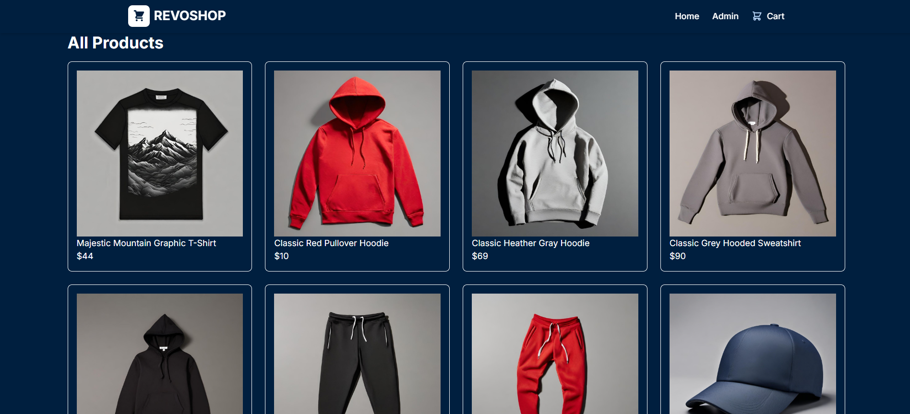
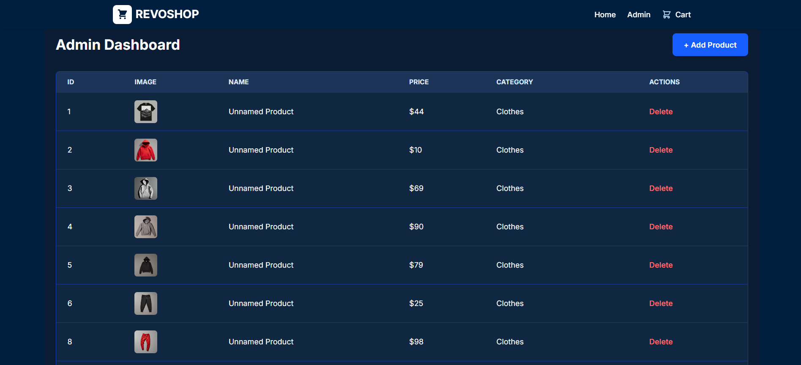
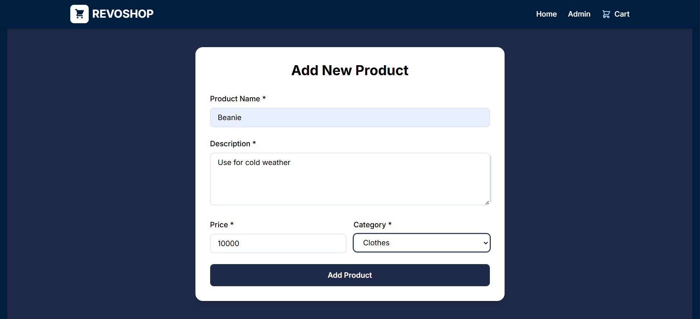
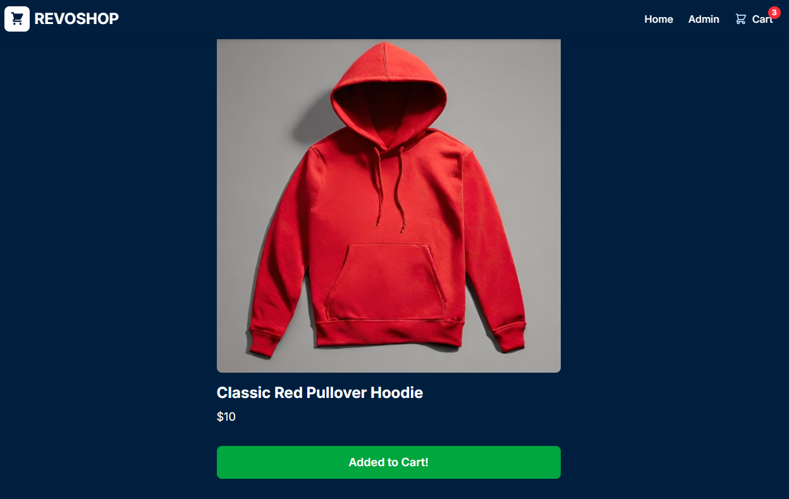
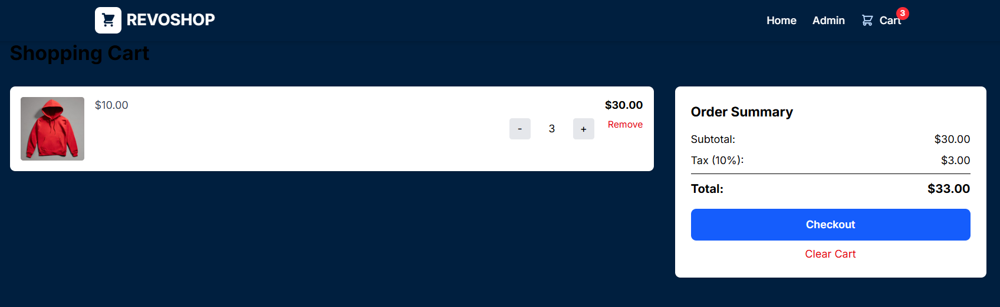

# Revoshop - Next.js E-commerce Platform

A modern, fictional online store built with Next.js, showcasing fundamental concepts and data fetching strategies.

## 🎯 Project Overview

Revoshop is a fictional e-commerce platform demonstrating Next.js fundamentals including:
- Server-Side Generation (SSG)
- Server-Side Rendering (SSR)
- API Routes
- Dynamic routing
- State management

## ✨ Features
### For Customers
- Browse products with a responsive grid layout
- View detailed product information
- Add products to shopping cart
- Interactive cart management
- Seamless checkout experience

### For Administrators
- Admin dashboard for product management
- Add new products
- Edit existing products
- Delete products
- Real-time product listing updates

## 🛠️ Tech Stack

- **Framework:** Next.js
- **Styling:** Tailwind CSS
- **Language:** JavaScript
- **State Management:** React Context API
- **Deployment:** Netlify

## 📋 Prerequisites

- Node.js 18.x or higher
- npm or yarn package manager
- Git

## 🚀 Getting Started

### Installation

1. Clone the repository:
```bash
git clone https://github.com/Revou-FSSE-Jun25/milestone-3-adsrchve.git
cd revoshop
```

2. Install dependencies:
```bash
npm install
# or
yarn install
```

3. Run the development server:
```bash
npm run dev
# or
yarn dev
```

4. Open [http://localhost:3000](http://localhost:3000) in your browser

## 📁 Project Structure

```
revoshop/
├── app/
│   ├── page.js                 
│   ├── layout.js               
│   ├── products/
│   │   └── [id]/
│   │       └── page.js         
│   ├── cart/
│   │   └── page.js             
│   └── admin/
│       ├── page.js             
│       └── add-product/
│           └── page.js         
├── components/
│   ├── AddToCartButton.js
│   ├── Footer.js
│   ├── Navbar.js
│   ├── ProductCard.js
│   └── ProductDetail.js
├── context/
│   └── CartContext.js          
└── lib/
    └── api.js                  
```

## 📸 Screenshots
Visit [https://revoshopands.netlify.app/](https://revoshopands.netlify.app/)

### Home Page


### Admin Dashboard


### Add New Product


### Add to Cart


### Shopping Cart



## 🎨 Features Breakdown

### Customer Features
1. **Product Browsing**: Grid layout with product cards
2. **Product Details**: Dedicated page with full information
3. **Cart Management**: Add/remove items, update quantities

### Admin Features
1. **Product Dashboard**: View all products
2. **Add Products**: Form to create new listings
3. **Edit Products**: Modify existing product details
4. **Delete Products**: Remove products from catalog

## 🌐 Deployment
### Deploy to Netlify

1. Push your code to GitHub
2. Go to [netlify.com](https://netlify.com)
3. Import your repository
4. Configure build settings (auto-detected for Next.js)
5. Deploy!

## 👨‍💻 Author
Anindya Nitisara - [GitHub Profile](https://github.com/adsrchve)